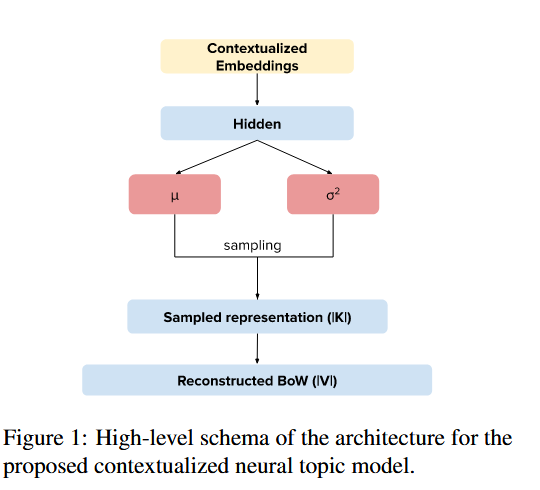

# Cross-lingual Contextualized Topic Models with Zero-shot Learning 

#### 摘要：

​	我们介绍了一种零样本跨语言主题模型。我们的模型在一种语言（此处为英语）上学习主题，并预测其他语言（此处为意大利语、法语、德语和葡萄牙语）中的未见文档的主题。

#### Introduce：

​	零样本学习：我们在一种语言上训练模型，并在训练时未涉及的多种其他语言上测试模型。

​	我们假设上下文信息可以替代 BoW 表示。我们在神经主题模型的采样过程之前，使用了一个神经编码层来处理来自上下文嵌入模型（如 BERT）的预训练文档表示。

​	这一改变使我们可以共同解决上述两个限制：

​	（i）我们的方法解决了测试时处理未见单词的问题，因为我们不需要它们有 BoW 表示；

​	（ii）该模型在除训练数据之外的语言中的未见文档上推断主题。推断出的主题由训练语言的标记组成，并且可以应用于任何支持的测试语言。

#### Contextualized Neural Topic Models：

​	扩展了基于变分自编码器的Neural-ProdLDA神经主题模型，提出了零样本主题模型（ZeroShotTM）。该模型使用SBERT预训练的多语言上下文表示，代替了传统的词袋（BoW）输入，解决了BoW模型无法处理单词顺序和上下文信息的问题。ZeroShotTM可以在低资源的语言环境下进行跨语言主题建模，预测新语言的主题分布，而不依赖于训练语言。该模型适用于零样本场景，尤其是在多语言的上下文中表现出色。

#### Experiments:

实验评估了两个主要假设：

（i）我们可以定义一个不依赖 BoW 输入，而是使用上下文信息的主题模型；

（ii）该模型可以处理零样本跨语言主题建模。

数据集： DBpedia 英文维基百科摘要中收集的数据集

​	W1——包含 20,000 个随机抽样的摘要。

​	W2——包含 100,000 篇英文文档。其中的 99,700 篇文档用作训练集，剩余的 300 篇文档视为测试集。

实验1：本文提出的模型，在单语料中抽取的主题评分与其他模型相比不会损失一致性

定量评估：对预测的文档-主题分布进行 100 次采样取平均，来获得更可靠的结果。

​	评估指标:

​	1.匹配度：衡量非英语测试文档的预测主题与对应英语文档的预测主题相同的次数百分比。分数越高越好。

​	2.中心嵌入余弦相似度 (CD)：比较描述预测主题的五个词的中心嵌入，衡量相似性。

​	3.KL 散度：计算测试文档的预测主题分布与其英文对应文档的分布之间的差异，分数越低越好。

​	两个基线：

​	1.Ori：将文档翻译为英语后进行主题建模，尽管易于获取，但可能引入偏差。

​	2.Uni：均匀分布的基线，提供了评估的下限。

​	模型的预测主题显著优于均匀分布的基线，超过 70% 的情况下，测试集上的预测主题与相同文档的英语主题匹配。同时，模型在上下文中的表现与使用翻译获得的主题一致，证明了模型能够在不需要翻译的情况下为未见语言的文档找到良好的主题。

#### Conclusions:

​	我们提出了一种新颖的神经架构，用于跨语言主题建模，使用上下文化的文档嵌入作为输入。我们的结果表明：(i) 上下文化的嵌入可以替代输入的词袋（BoW）表示；(ii) 使用上下文化的表示使我们能够处理零样本跨语言主题建模。最终模型可以在任何一种语言上进行训练，并应用于任何有嵌入可用的其他语言。
